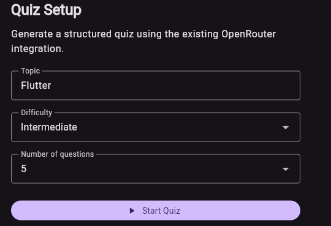
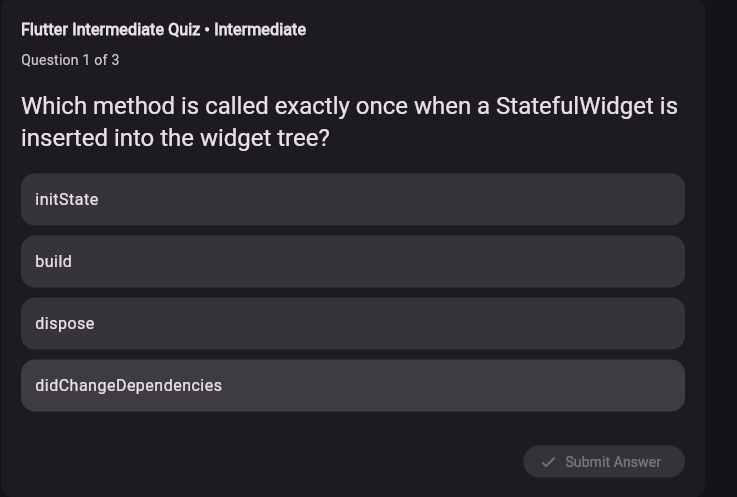
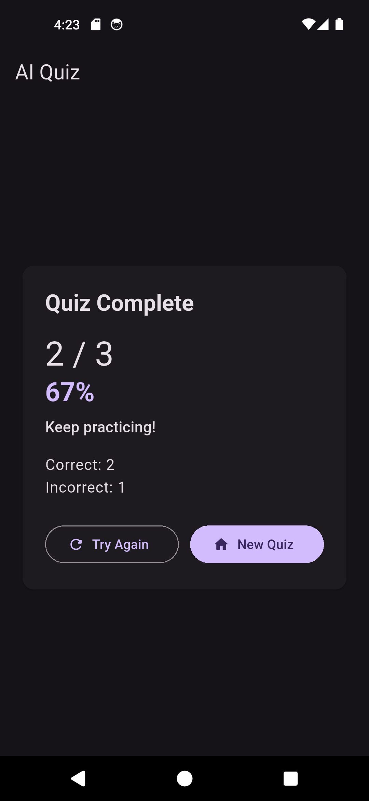

# AI Quiz App

This app generates quiz content from OpenRouter and runs the full quiz flow in Flutter.

The user enters a topic, chooses a difficulty, and picks a question count. The app sends the request to OpenRouter, parses the structured JSON response, and then renders the quiz experience in Flutter with GenUI-driven dynamic UI.

## What this app does

- Builds a quiz setup screen with topic, difficulty, and question count
- Calls OpenRouter to generate structured quiz JSON
- Parses the AI response into typed quiz models
- Shows one question at a time with answer selection and submission
- Tracks answers and calculates the final score
- Displays a result screen with performance feedback
- Keeps the app focused on the quiz flow without legacy settings or demo screens

## Architecture

- OpenRouter: generates the quiz data
- Flutter: owns state, scoring, navigation, and result logic
- GenUI/A2UI: renders the generated quiz UI surface

## Screenshots

<p align="center">
  
  
  
</p>

## Setup

1. Install dependencies:

```bash
flutter pub get
```

2. Create your environment file:

```bash
cp .env.example .env
```

3. Add your OpenRouter API key to `.env` using the variable name in the example file.

4. Run the app:

```bash
flutter run
```

## Notes

This is a focused learning project for AI-generated quiz content and interactive quiz UI. It keeps the implementation simple and quiz-first, with the API key handled locally for development and experimentation.
